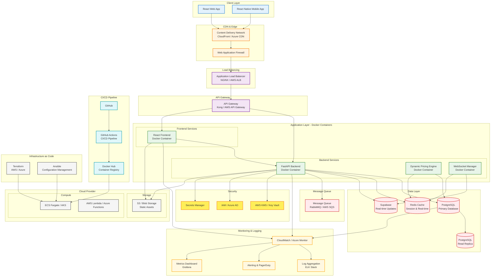

# FoodHawk Platform - Cloud Architecture Diagram

## Mermaid Diagram (Professional Cloud Architecture)



## ASCII Architecture Diagram (Presentation Ready)

```
┌─────────────────────────────────────────────────────────────────────────────────────────┐
│                           FOODHAWK PLATFORM - CLOUD ARCHITECTURE                        │
├─────────────────────────────────────────────────────────────────────────────────────────┤
│                                                                                         │
│  ┌─────────────────────────────────────────────────────────────────────────────────┐   │
│  │                              CLIENT LAYER                                         │   │
│  │  ┌──────────────────┐                    ┌──────────────────┐                 │   │
│  │  │   React Web App  │                    │ React Native App │                 │   │
│  │  │   (Vendor/Customer)                  │    (Mobile)       │                 │   │
│  │  └────────┬─────────┘                    └────────┬─────────┘                 │   │
│  └───────────┼──────────────────────────────────────┼─────────────────────────────┘   │
│              │                                      │                               │
└──────────────┼──────────────────────────────────────┼───────────────────────────────────┘
               │                                      │
               ▼                                      ▼
┌─────────────────────────────────────────────────────────────────────────────────────────┐
│                           EDGE & SECURITY LAYER                                        │
│  ┌───────────────────────────────────────────────────────────────────────────────┐  │
│  │  Content Delivery Network (CloudFront/Azure CDN)                                │  │
│  │  ┌───────────────────────────────────────────────────────────────────────┐  │  │
│  │  │  Web Application Firewall (WAF)                                          │  │  │
│  │  │  • DDoS Protection                                                      │  │  │
│  │  │  • SQL Injection Prevention                                             │  │  │
│  │  │  • XSS Protection                                                        │  │  │
│  │  └───────────────────────────────────────────────────────────────────────┘  │  │
│  └───────────────────────────────────────────────────────────────────────────────┘  │
│                                      │                                             │
└──────────────────────────────────────┼───────────────────────────────────────────────┘
                                       ▼
┌─────────────────────────────────────────────────────────────────────────────────────────┐
│                           LOAD BALANCING LAYER                                       │
│  ┌───────────────────────────────────────────────────────────────────────────────┐  │
│  │  Application Load Balancer (AWS ALB / Azure Load Balancer)                     │  │
│  │  • SSL Termination                                                           │  │
│  │  • Health Checks                                                              │  │
│  │  • Auto Scaling                                                               │  │
│  │  • Path-based Routing                                                         │  │
│  └───────────────────────────────────────────────────────────────────────────────┘  │
│                                      │                                             │
└──────────────────────────────────────┼───────────────────────────────────────────────┘
                                       ▼
┌─────────────────────────────────────────────────────────────────────────────────────────┐
│                           API GATEWAY LAYER                                          │
│  ┌───────────────────────────────────────────────────────────────────────────────┐  │
│  │  API Gateway (Kong / AWS API Gateway)                                         │  │
│  │  • Rate Limiting                                                              │  │
│  │  • Authentication                                                            │  │
│  │  • Request Validation                                                         │  │
│  │  • API Versioning                                                             │  │
│  └───────────────────────────────────────────────────────────────────────────────┘  │
│                                      │                                             │
└──────────────────────────────────────┼───────────────────────────────────────────────┘
                                       ▼
┌─────────────────────────────────────────────────────────────────────────────────────────┐
│                           APPLICATION LAYER (Docker Containers)                        │
│  ┌───────────────────────────────────────────────────────────────────────────────┐  │
│  │  ECS Fargate / Azure Kubernetes Service (AKS)                                 │  │
│  │                                                                               │  │
│  │  ┌─────────────────────────────────────────────────────────────────────┐     │  │
│  │  │  Frontend Services                                                    │     │  │
│  │  │  ┌─────────────────────────────────────────────────────────────┐    │     │  │
│  │  │  │ React Frontend (Docker)                                      │    │     │  │
│  │  │  │ • Nginx Reverse Proxy                                       │    │     │  │
│  │  │  │ • Static File Serving                                      │    │     │  │
│  │  │  │ • SPA Routing                                               │    │     │  │
│  │  │  └─────────────────────────────────────────────────────────────┘    │     │  │
│  │  └─────────────────────────────────────────────────────────────────────┘     │  │
│  │                                                                               │  │
│  │  ┌─────────────────────────────────────────────────────────────────────┐     │  │
│  │  │  Backend Services (FastAPI)                                         │     │  │
│  │  │  ┌─────────────────────────────────────────────────────────────┐    │     │  │
│  │  │  │ FastAPI Backend (Docker)                                    │    │     │  │
│  │  │  │ • REST API Endpoints                                        │    │     │  │
│  │  │  │ • JWT Authentication                                        │    │     │  │
│  │  │  │ • Business Logic                                            │    │     │  │
│  │  │  └─────────────────────────────────────────────────────────────┘    │     │  │
│  │  │  ┌─────────────────────────────────────────────────────────────┐    │     │  │
│  │  │  │ Dynamic Pricing Engine (Docker)                             │    │     │  │
│  │  │  │ • Background Task                                          │    │     │  │
│  │  │  │ • Expiry-based Discounts                                    │    │     │  │
│  │  │  │ • WebSocket Broadcasts                                      │    │     │  │
│  │  │  └─────────────────────────────────────────────────────────────┘    │     │  │
│  │  │  ┌─────────────────────────────────────────────────────────────┐    │     │  │
│  │  │  │ WebSocket Manager (Docker)                                  │    │     │  │
│  │  │  │ • Real-time Updates                                         │    │     │  │
│  │  │  │ • Connection Management                                     │    │     │  │
│  │  │  │ • Event Broadcasting                                        │    │     │  │
│  │  │  └─────────────────────────────────────────────────────────────┘    │     │  │
│  │  └─────────────────────────────────────────────────────────────────────┘     │  │
│  └───────────────────────────────────────────────────────────────────────────────┘  │
└─────────────────────────────────────────────────────────────────────────────────────────┘
                                       │
                                       ▼
┌─────────────────────────────────────────────────────────────────────────────────────────┐
│                           DATA LAYER                                                   │
│  ┌───────────────────────────────────────────────────────────────────────────────┐  │
│  │  PostgreSQL Database (AWS RDS / Azure Database for PostgreSQL)                  │  │
│  │  ┌─────────────────────────────────────────────────────────────────────┐     │  │
│  │  │ Primary Instance                                                       │     │  │
│  │  │ • Multi-AZ Deployment                                                   │     │  │
│  │  │ • Automated Backups                                                     │     │  │
│  │  │ • Point-in-time Recovery                                                │     │  │
│  │  └─────────────────────────────────────────────────────────────────────┘     │  │
│  │  ┌─────────────────────────────────────────────────────────────────────┐     │  │
│  │  │ Read Replicas (2-3)                                                   │     │  │
│  │  │ • Analytics Queries                                                    │     │  │
│  │  │ • Reporting                                                            │     │  │
│  │  │ • Load Distribution                                                    │     │  │
│  │  └─────────────────────────────────────────────────────────────────────┘     │  │
│  └───────────────────────────────────────────────────────────────────────────────┘  │
│                                                                                      │
│  ┌───────────────────────────────────────────────────────────────────────────────┐  │
│  │  Redis Cache (ElastiCache / Azure Cache)                                      │  │
│  │  • Session Storage                                                            │  │
│  │  • API Response Caching                                                       │  │
│  │  • Real-time Data Cache                                                        │  │
│  │  • Pub/Sub for Events                                                          │  │
│  └───────────────────────────────────────────────────────────────────────────────┘  │
│                                                                                      │
│  ┌───────────────────────────────────────────────────────────────────────────────┐  │
│  │  Supabase Real-time Updates                                                    │  │
│  │  • WebSocket Subscriptions                                                     │  │
│  │  • Real-time Database Changes                                                  │  │
│  │  • Presence Tracking                                                           │  │
│  │  • Broadcast Channels                                                          │  │
│  └───────────────────────────────────────────────────────────────────────────────┘  │
│                                                                                      │
│  ┌───────────────────────────────────────────────────────────────────────────────┐  │
│  │  Message Queue (RabbitMQ / AWS SQS)                                            │  │
│  │  • Asynchronous Task Processing                                                 │  │
│  │  • Event-driven Architecture                                                    │  │
│  │  • Order Processing Queue                                                       │  │
│  │  • Notification Queue                                                           │  │
│  └───────────────────────────────────────────────────────────────────────────────┘  │
└─────────────────────────────────────────────────────────────────────────────────────────┘

┌─────────────────────────────────────────────────────────────────────────────────────────┐
│                           STORAGE LAYER                                               │
│  ┌───────────────────────────────────────────────────────────────────────────────┐  │
│  │  Object Storage (S3 / Azure Blob Storage)                                     │  │
│  │  • Product Images                                                              │  │
│  │  • Static Assets                                                               │  │
│  │  • User Uploads                                                                │  │
│  │  • CDN Integration                                                             │  │
│  └───────────────────────────────────────────────────────────────────────────────┘  │
└─────────────────────────────────────────────────────────────────────────────────────────┘

┌─────────────────────────────────────────────────────────────────────────────────────────┐
│                           CI/CD PIPELINE                                              │
│  ┌───────────────────────────────────────────────────────────────────────────────┐  │
│  │  GitHub Repository                                                              │  │
│  │  • Source Code                                                                 │  │
│  │  • Dockerfiles                                                                 │  │
│  │  • Terraform Config                                                            │  │
│  │  └─────────────────────────────────────────────────────────────────────┐     │  │
│  └─────────────────────────────────────────────────────────────────────────────┘     │
│                                        │                                            │
│                                        ▼                                            │
│  ┌───────────────────────────────────────────────────────────────────────────────┐  │
│  │  GitHub Actions CI/CD Pipeline                                                │  │
│  │  ┌─────────────────────────────────────────────────────────────────────┐     │  │
│  │  │ 1. Trigger on Push/PR                                                 │     │  │
│  │  │ 2. Run Tests (Backend & Frontend)                                     │     │  │
│  │  │ 3. Linting & Code Quality                                            │     │  │
│  │  │ 4. Build Docker Images                                                │     │  │
│  │  │ 5. Security Scanning                                                  │     │  │
│  │  │ 6. Push to Docker Hub                                                 │     │  │
│  │  │ 7. Deploy to Staging                                                  │     │  │
│  │  │ 8. Manual Approval for Production                                    │     │  │
│  │  │ 9. Deploy to Production                                              │     │  │
│  │  └─────────────────────────────────────────────────────────────────────┘     │  │
│  └───────────────────────────────────────────────────────────────────────────────┘  │
│                                        │                                            │
│                                        ▼                                            │
│  ┌───────────────────────────────────────────────────────────────────────────────┐  │
│  │  Docker Hub Container Registry                                               │  │
│  │  • food-hawk-backend:latest                                                  │  │
│  │  • food-hawk-frontend:latest                                                  │  │
│  │  • food-hawk-pricing:latest                                                   │  │
│  │  • food-hawk-websocket:latest                                                 │  │
│  └───────────────────────────────────────────────────────────────────────────────┘  │
└─────────────────────────────────────────────────────────────────────────────────────────┘

┌─────────────────────────────────────────────────────────────────────────────────────────┐
│                           INFRASTRUCTURE AS CODE                                      │
│  ┌───────────────────────────────────────────────────────────────────────────────┐  │
│  │  Terraform (AWS / Azure)                                                      │  │
│  │  • VPC & Networking                                                           │  │
│  │  • ECS Fargate Clusters                                                       │  │
│  │  • RDS PostgreSQL                                                              │  │
│  │  • Application Load Balancer                                                   │  │
│  │  • Security Groups & IAM Roles                                                 │  │
│  │  • CloudWatch Alarms                                                           │  │
│  └───────────────────────────────────────────────────────────────────────────────┘  │
│                                                                                      │
│  ┌───────────────────────────────────────────────────────────────────────────────┐  │
│  │  Ansible Configuration Management                                             │  │
│  │  • Server Provisioning                                                        │  │
│  │  • Docker Installation                                                        │  │
│  │  • Application Deployment                                                      │  │
│  │  • Configuration Updates                                                       │  │
│  │  • Security Hardening                                                          │  │
│  └───────────────────────────────────────────────────────────────────────────────┘  │
└─────────────────────────────────────────────────────────────────────────────────────────┘

┌─────────────────────────────────────────────────────────────────────────────────────────┐
│                           MONITORING & LOGGING                                        │
│  ┌───────────────────────────────────────────────────────────────────────────────┐  │
│  │  CloudWatch / Azure Monitor                                                    │  │
│  │  • Application Logs                                                             │  │
│  │  • Performance Metrics                                                          │  │
│  │  • Custom Metrics                                                              │  │
│  │  • Log Insights                                                                │  │
│  └───────────────────────────────────────────────────────────────────────────────┘  │
│                                                                                      │
│  ┌───────────────────────────────────────────────────────────────────────────────┐  │
│  │  ELK Stack (Elasticsearch, Logstash, Kibana)                                  │  │
│  │  • Centralized Logging                                                        │  │
│  │  • Log Aggregation                                                             │  │
│  │  • Search & Analytics                                                          │  │
│  │  • Visualization                                                               │  │
│  └───────────────────────────────────────────────────────────────────────────────┘  │
│                                                                                      │
│  ┌───────────────────────────────────────────────────────────────────────────────┐  │
│  │  Grafana Dashboard                                                             │  │
│  │  • Real-time Metrics                                                           │  │
│  │  • Performance Dashboards                                                      │  │
│  │  • Alert Rules                                                                 │  │
│  │  • Business Metrics                                                            │  │
│  └───────────────────────────────────────────────────────────────────────────────┘  │
│                                                                                      │
│  ┌───────────────────────────────────────────────────────────────────────────────┐  │
│  │  Alerting & PagerDuty                                                          │  │
│  │  • Critical Alerts                                                             │  │
│  │  • On-call Rotation                                                            │  │
│  │  • Incident Response                                                           │  │
│  │  • Notification Channels                                                       │  │
│  └───────────────────────────────────────────────────────────────────────────────┘  │
└─────────────────────────────────────────────────────────────────────────────────────────┘

┌─────────────────────────────────────────────────────────────────────────────────────────┐
│                           SECURITY LAYER                                             │
│  ┌───────────────────────────────────────────────────────────────────────────────┐  │
│  │  AWS KMS / Azure Key Vault                                                     │  │
│  │  • Encryption Keys                                                              │  │
│  │  • Secrets Management                                                           │  │
│  │  • Certificate Management                                                       │  │
│  └───────────────────────────────────────────────────────────────────────────────┘  │
│                                                                                      │
│  ┌───────────────────────────────────────────────────────────────────────────────┐  │
│  │  IAM / Azure AD                                                                 │  │
│  │  • Role-based Access Control                                                   │  │
│  │  • Service Accounts                                                             │  │
│  │  • Multi-factor Authentication                                                   │  │
│  │  • Audit Logging                                                               │  │
│  └───────────────────────────────────────────────────────────────────────────────┘  │
│                                                                                      │
│  ┌───────────────────────────────────────────────────────────────────────────────┐  │
│  │  Secrets Manager                                                               │  │
│  │  • Database Credentials                                                        │  │
│  │  • API Keys                                                                     │  │
│  │  • JWT Secrets                                                                  │  │
│  │  • Third-party Tokens                                                           │  │
│  └───────────────────────────────────────────────────────────────────────────────┘  │
└─────────────────────────────────────────────────────────────────────────────────────────┘
```

## Component Legend

| Component | Purpose | Technology |
|-----------|---------|------------|
| **React Web App** | Vendor & customer web interface | React 18, Tailwind CSS |
| **React Native App** | Mobile application | React Native Expo |
| **CDN** | Content delivery & caching | CloudFront / Azure CDN |
| **WAF** | Security protection | AWS WAF / Azure WAF |
| **Load Balancer** | Traffic distribution | AWS ALB / Azure LB |
| **API Gateway** | API management | Kong / AWS API Gateway |
| **FastAPI Backend** | REST API & business logic | Python FastAPI |
| **Pricing Engine** | Dynamic pricing calculations | Python asyncio |
| **WebSocket Manager** | Real-time updates | Python websockets |
| **PostgreSQL** | Primary database | AWS RDS / Azure Database |
| **Redis** | Caching & sessions | ElastiCache / Azure Cache |
| **Supabase** | Real-time database updates | Supabase |
| **Message Queue** | Async task processing | RabbitMQ / AWS SQS |
| **Docker Hub** | Container registry | Docker Hub |
| **GitHub Actions** | CI/CD pipeline | GitHub Actions |
| **Terraform** | Infrastructure as Code | Terraform |
| **Ansible** | Configuration management | Ansible |
| **CloudWatch** | Monitoring & logging | AWS CloudWatch |
| **Grafana** | Metrics dashboard | Grafana |
| **KMS** | Key management | AWS KMS / Azure Key Vault |

## Data Flow

### User Request Flow
```
User → CDN → WAF → Load Balancer → API Gateway → FastAPI → PostgreSQL
```

### Real-time Update Flow
```
Pricing Engine → PostgreSQL → Supabase → WebSocket → Client
```

### CI/CD Flow
```
GitHub Push → GitHub Actions → Docker Build → Docker Hub → ECS Deployment
```

### Monitoring Flow
```
All Services → CloudWatch → ELK Stack → Grafana → Alerts
```

## Security Layers

1. **Network Security**: WAF, VPC, Security Groups
2. **Application Security**: API Gateway, Rate Limiting, JWT Auth
3. **Data Security**: KMS Encryption, SSL/TLS, Secrets Manager
4. **Identity Security**: IAM, MFA, RBAC

## High Availability Features

- **Multi-AZ Deployment**: Database and application across availability zones
- **Auto Scaling**: ECS Fargate scales based on demand
- **Read Replicas**: PostgreSQL read replicas for analytics
- **Health Checks**: Automated health monitoring and recovery
- **Disaster Recovery**: Automated backups and point-in-time recovery

---

**Diagram Version**: 2.0  
**Last Updated**: 2026-05-20  
**Status**: Professional Cloud Architecture for Production Deployment
